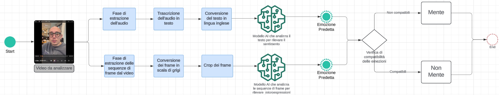
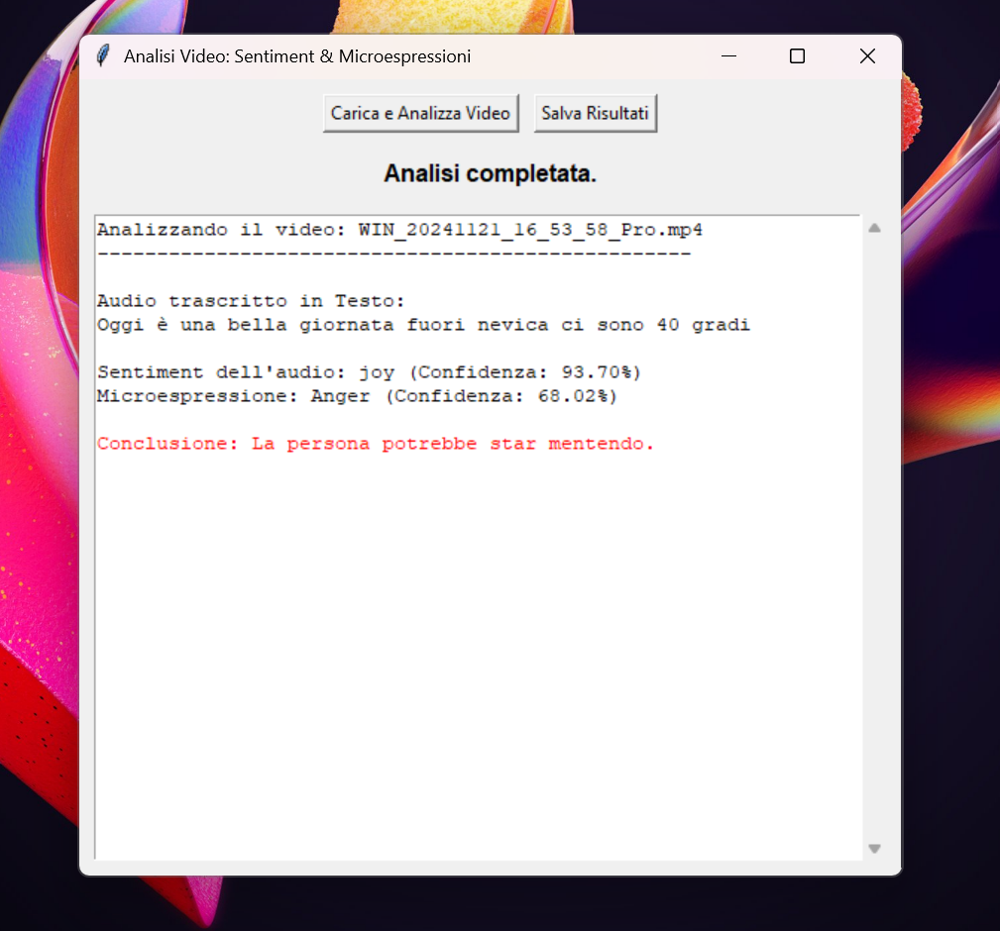

# Lie Detection Project

Benvenuti nel progetto **Lie Detection**, un sistema che combina:
- L'analisi delle **microespressioni facciali**.
- L'analisi del **sentimento** nei testi trascritti da audio.

Questo repository contiene tutti i componenti necessari per il sistema, tra cui modelli AI, script, risultati di test, e un'interfaccia utente per l'analisi video.

---

## 📁 Struttura del Repository

Ecco la struttura principale del repository e il contenuto di ciascuna sezione:

### 1. **Notebook Scripts**
Contiene i notebook per il preprocessing e l'analisi del dataset SAMM, e per l'analisi del sentimento nei testi:
- **`SAMM_Preprocessing_and_Training.ipynb`**
- **`Sentiment_Analysis_Testo.ipynb`**

---

### 2. **Sviluppo Eseguibile**
Codice Python per integrare i modelli e l'interfaccia:
- **`main.py`**: Avvio del sistema.
- **`microexpression.py`**: Analisi delle microespressioni facciali.
- **`sentiment_analysis.py`**: Analisi del sentimento nei testi.
---


### 3. **Modelli AI & Eseguibili**
Modelli AI addestrati per l'analisi delle microespressioni facciali:
- **`CNN3D_LSTM`**
- **`CNN3D_LSTM_Finetuning_ResNet50`**
- **`CNN3D_No_Finetuning`**

Ogni cartella contiene il modello AI e l'eseguibile associato.

---

### 4. **Risultati dei Test**
Contiene i risultati dei test effettuati su video, organizzati in sottocartelle:
- File `.txt` per ogni test.
- **`Risultati.xlsx`** con un riepilogo tabellare.


---
## 📊 Schema del Sistema



---

## 📊 Esempio di Caso di Test

Di seguito è riportato un esempio dell'analisi eseguita dal sistema:



**Descrizione del caso di test:**
- **Input**: Un video contenente microespressioni facciali catturate durante un'intervista.
- **Output**:
  - **Microespressione individuata**: "Joy".
  - **Sentimento analizzato dal testo trascritto**: "Anger".
  - **Conclusione**: "La persona potrebbe star mentendo".
- **Visualizzazione**:
  - I risultati delle analisi vengono mostrati in tempo reale nell'interfaccia utente.

---

## 📜 Licenza
Questo progetto è rilasciato sotto la licenza descritta in **LICENSE.txt**.

---

## 🚀 Come iniziare
1. Clona il repository:
   ```bash
   git clone https://github.com/LeonardoDaCodice/Lie_Detection.git
